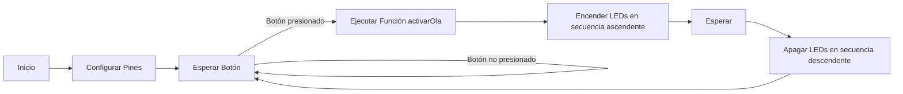

# Practica extra 1.1: Ola de colores con LEDs. 
## Objetivos: 
- Encender 5 LEDs consecutivos en orden. 
- Pagar los mismos una vez estan todos encendidos en orden pero en la otra dirección. 
- Utilizar una interrupción. 
## Materiales: 
- ESP32-S3
- 5 LEDs (azules)
- 5 resistencias 220 Ohm
## Procedimiento: 
**Código:**<br> 
``` cpp
    #include <Arduino.h>

    const int numLEDs = 5; // Número de LEDs en línea recta
    const int ledPins[] = {2, 3, 4, 5, 6}; // Pines a los que están conectados los LEDs
    const int buttonPin = 7; // Pin al que está conectado el botón

    void activarOla();

    void setup() {
    Serial.begin(115200);

    for (int i = 0; i < numLEDs; i++) {
        pinMode(ledPins[i], OUTPUT);
    }

    pinMode(buttonPin, INPUT_PULLUP); // Establece el pin del botón como entrada con resistencia pull-up
    }

    void loop() {
    if (digitalRead(buttonPin) == LOW) { // Si se presiona el botón
        activarOla(); // Activa la animación de la ola
    }
    }

    void activarOla() {
    // Enciende los LEDs en secuencia ascendente
    for (int i = 0; i < numLEDs; i++) {
        digitalWrite(ledPins[i], HIGH);
        delay(100);
    }

    // Apaga los LEDs en secuencia descendente
    for (int i = numLEDs - 1; i >= 0; i--) {
        digitalWrite(ledPins[i], LOW);
        delay(100);
    }
    }
```
**Descripción:**

Controla una secuencia de LEDs para simular una "ola" de encendido y apagado.
Primero definimos unas constantes necesarias que estàn explicadas en el mismo còdigo. 
En la función ''setup()'' cómo és habitual, inicializamos la comunicación serial. A continuación configuramos los pines necesarios para los LEDs cómo salidas, y el botón cómo entrada. 
En el bucle principal ''loop()'', primero verifica si el botón està presionado. Si lo està, llama a la función ''acticarOla()'', que cómo su nombre indica, activarà la ola de colores: enciende los LEDs uno por uno en secuencia ascendente. Espera un rato con un ''delay(100)'' entre encender cada led pàra que se haga notable. Después apaga los LEDs uno por uno en secuencia descendente con el mismo delay que antes entre el apagado de cada LED.

**Diagrama de flujos:**



## Video: 

## Conclusión: 
Cuando se presiona el botón, los LEDs se encenderán uno tras otro en orden ascendente y luego se apagarán en el mismo orden descendente, creando así el efecto visual de una "ola" de luz.
